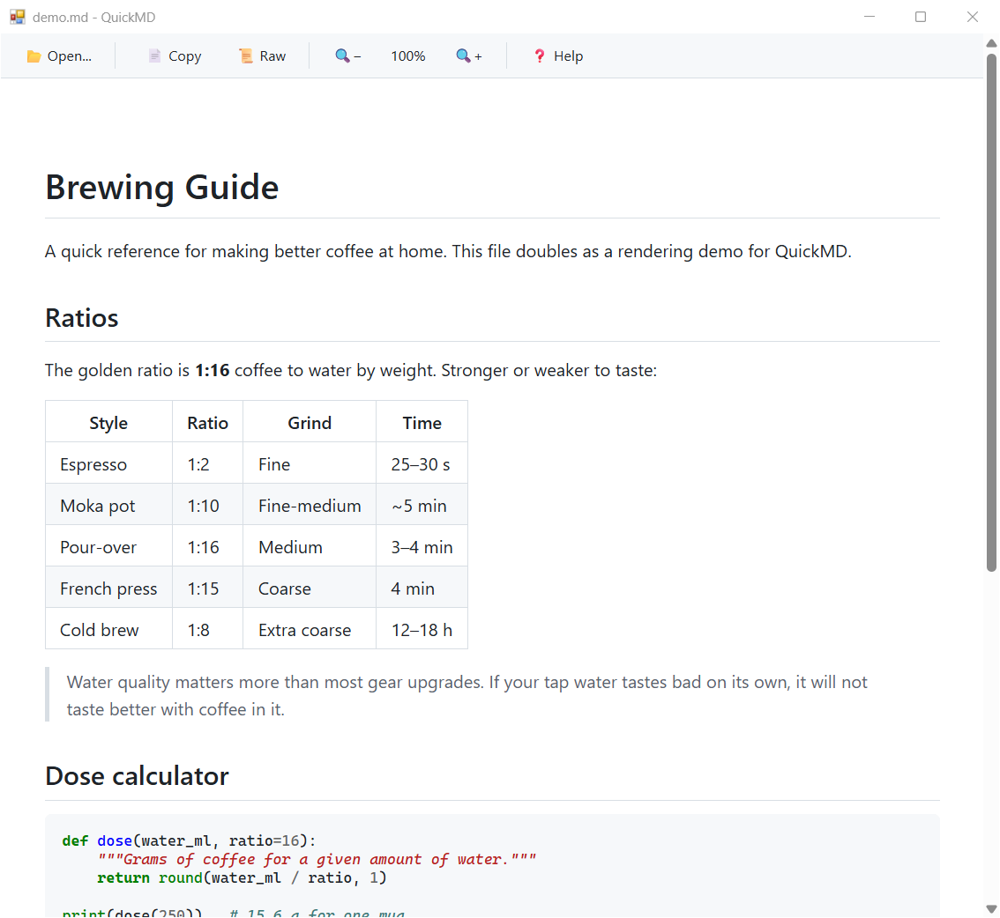

# QuickMD

A simple Markdown viewer for Linux and Windows. Opens a rendered view of a Markdown file without starting an editor or a browser tab.



## Features

- Renders Markdown with tables, fenced code blocks and footnotes
- Toolbar with open, copy, raw source toggle and zoom controls
- Syntax highlighting for code blocks (when Pygments is installed)
- Follows the system light/dark theme
- Reloads automatically when the file changes on disk
- Relative links to other Markdown files open in the same window
- External links open in the default browser
- Zoom with Ctrl + scroll wheel
- The source view is editable; "Save as..." writes a copy, so the opened file is never modified in place

## Installation

### Requirements

- Python 3
- pywebview
- markdown
- Pygments (optional, for syntax highlighting)
- pymdown-extensions (optional, for task lists and strikethrough)

### Linux

QuickMD renders through WebKitGTK, so the GTK bindings and WebKit engine come from your distribution.

Fedora:

```bash
sudo dnf install python3-gobject gtk3 webkit2gtk4.1
```

Ubuntu/Debian:

```bash
sudo apt install python3-gi gir1.2-webkit2-4.1
```

Arch:

```bash
sudo pacman -S python-gobject gtk3 webkit2gtk-4.1
```

Python packages:

```bash
pip install pywebview markdown pygments pymdown-extensions
```

### Windows

Rendering uses the WebView2 runtime that ships with Windows 10 and 11, so only the Python packages are needed:

```powershell
pip install pywebview markdown pygments pymdown-extensions
```

To build a standalone `quickmd.exe` that runs without Python installed:

```powershell
pip install pyinstaller
pyinstaller --onefile --windowed --name quickmd quickmd.py
```

The executable appears in `dist\quickmd.exe`. You can associate it with `.md` files through "Open with" in Explorer.

### Optional file manager integration (Linux)

Place this desktop entry at `~/.local/share/applications/quickmd.desktop` (update paths accordingly):

```ini
[Desktop Entry]
Name=QuickMD
Comment=Quickly view Markdown files
Exec=/path/to/quickmd.py %f
Terminal=false
Type=Application
Categories=Utility;Viewer;
MimeType=text/markdown;
Keywords=Markdown;Viewer;
StartupNotify=true
```

Then run:

```bash
chmod +x /path/to/quickmd.py
update-desktop-database ~/.local/share/applications/
```

### Optional Explorer integration (Windows)

This adds QuickMD to the "Open with" list for `.md` files. It only touches the current user's registry, no administrator rights needed. Update the script path accordingly:

```powershell
$pyw = (Get-Command pythonw).Source
$cmd = '"{0}" "C:\path\to\quickmd.py" "%1"' -f $pyw
New-Item 'HKCU:\Software\Classes\QuickMD.md\shell\open\command' -Force | Out-Null
Set-ItemProperty 'HKCU:\Software\Classes\QuickMD.md' -Name '(default)' -Value 'Markdown Document'
Set-ItemProperty 'HKCU:\Software\Classes\QuickMD.md\shell\open' -Name 'FriendlyAppName' -Value 'QuickMD'
Set-ItemProperty 'HKCU:\Software\Classes\QuickMD.md\shell\open\command' -Name '(default)' -Value $cmd
if (-not (Test-Path 'HKCU:\Software\Classes\.md\OpenWithProgids')) { New-Item 'HKCU:\Software\Classes\.md\OpenWithProgids' -Force | Out-Null }
Set-ItemProperty 'HKCU:\Software\Classes\.md\OpenWithProgids' -Name 'QuickMD.md' -Value ''
```

To remove it again:

```powershell
Remove-Item 'HKCU:\Software\Classes\QuickMD.md' -Recurse
Remove-ItemProperty 'HKCU:\Software\Classes\.md\OpenWithProgids' -Name 'QuickMD.md'
```

## Usage

Linux:

```bash
python3 quickmd.py                    # Launch empty, open a file with Ctrl+O
python3 quickmd.py /path/to/file.md   # Open a specific file
```

Windows, use `pythonw` so no console window appears:

```powershell
pythonw quickmd.py C:\path\to\file.md
```

Renaming the script to `quickmd.pyw` has the same effect when double-clicking it. The PyInstaller build (`--windowed`) also runs without a console.

### Keyboard controls

| Function | Control |
|----------|---------|
| Open file | Ctrl+O or "Open..." button |
| Paste clipboard text as a new document | Ctrl+V or "Paste" button |
| Save a copy (including edits) | Ctrl+S or "Save as..." button |
| Reload file | Ctrl+R |
| Show the editable source | Ctrl+U or the "Show source" checkbox |
| Copy selection, or the whole source | "Copy" button |
| Copy selected text | Ctrl+C |
| Zoom in/out | Ctrl + scroll wheel, Ctrl+= / Ctrl+-, toolbar buttons |
| Reset zoom | Ctrl+0 |
| Keyboard shortcut overview | "Help" button |
| Quit | Ctrl+W or Ctrl+Q |

## License

MIT License
